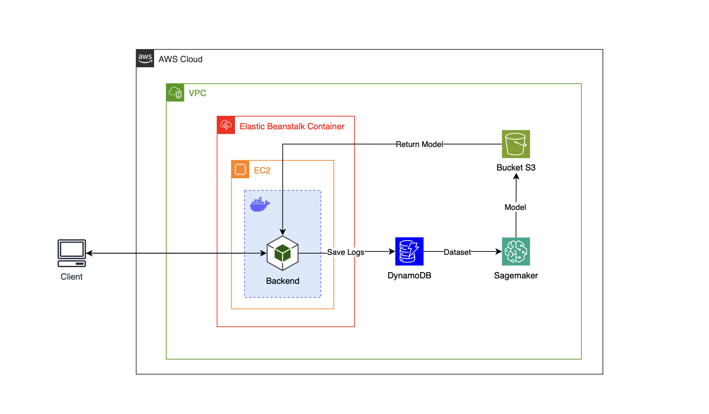

# HOTEL RESERVATION PREDICTION

### **OVERVIEW**

The project aims to develop a machine learning model capable of predicting the cost per room in a hotel reservation. The creation and training of the model were carried out using _Amazon SageMaker_, and the training data is stored in _DynamoDB_. After training, the model is stored in _Amazon S3_. To enable the utilization of the model, an API service was developed using _Python_ and the _FastAPI_ framework to load the trained model from _S3_ and perform cost per room inference. The deployment of the service is conducted through _AWS Elastic Beanstalk_.

---

### **ARCHITECTURE**

---

> [!WARNING]
> It is imperative for users to deploy their own application on AWS using their own credentials to ensure compliance and security. This ensures that users have full control over their application's environment and data, facilitating customization and enhancing security measures.

### **MODEL TRAINING**

The dataset used is the [Hotel Reservations Dataset](https://www.kaggle.com/datasets/ahsan81/hotel-reservations-classification-dataset), which contains various information about thousands of reservations, including the price per room, our target variable for analysis. The dataset is stored in _DynamoDB_ and retrieved within _SageMaker_.

> [!IMPORTANT]
> The data preprocessing included adding a new label column to classify the price into three numerical categories:
>
> $1$ Price LTE to $85$ | $2$ Price GT $85$ and LT $115$ | $3$ Price GTE to $115$

Subsequently, the original column containing the price is removed. Additionally, exploratory data analysis was conducted to identify the most relevant correlations for training.

> [!NOTE]
> KNN, Logistic Regression, and XGBoost models were tested using both the original dataset and the dataset with selected relevant columns.

The results with the selected dataset were:

| Model                     | Precision | Recall | F1-score | Accuracy |
| ------------------------- | --------- | ------ | -------- | -------- |
| **KNN**                   | $0.62$    | $0.62$ | $0.62$   | $0.62$   |
| **Linear Learner**        | $0.57$    | $0.59$ | $0.56$   | $0.57$   |
| **XGBoost**               | $0.82$    | $0.82$ | $0.82$   | $0.82$   |
| **XGBoost Oversampling**  | $0.83$    | $0.83$ | $0.83$   | $0.82$   |
| **XGBoost Undersampling** | $0.83$    | $0.83$ | $0.83$   | $0.83$   |

The results with the original dataset were:

| Model                     | Precision | Recall | F1-score | Accuracy |
| ------------------------- | --------- | ------ | -------- | -------- |
| **Linear Learner**        | $0.61$    | $0.62$ | $0.61$   | $0.61$   |
| **XGBoost**               | $0.84$    | $0.84$ | $0.84$   | $0.837$  |
| **XGBoost Oversampling**  | $0.85$    | $0.85$ | $0.85$   | $0.84$   |
| **XGBoost Undersampling** | $0.83$    | $0.83$ | $0.83$   | $0.835$  |

Based on the results, it was observed that the _XGBoost_ model demonstrated the best performance with both datasets. Strategies such as oversampling, undersampling, and hyperparameter tuning were applied to enhance the model. It was concluded that the optimal performance of this model was achieved using the original dataset with oversampling, resulting in an accuracy of $84$%.

---

### **API IMPLEMENTATION**

The Hotel Reservation Prediction API was developed using the _FastAPI_ framework, leveraging its efficiency. Users can utilize _Swagger_ to easily submit reservation details such as the number of adults, children, nights of stay, and lead time. The API returns the predicted class for the reservation, indicating the corresponding price range.

| Method | Endpoint        | Description                 |
| ------ | --------------- | --------------------------- |
| POST   | /api/v1/predict | Submits data for prediction |

The inference process comprises several sequential steps. Firstly, incoming parameters are received and subjected to validation using Pydantic, a _Python_ library designed for data validation. Following this, categorical parameters undergo conversion into a binary numerical format to ensure compatibility with the model. Subsequently, the _XGBoost_ model executes prediction operations on the transformed input data, facilitated by its ability to handle structured data effectively. Post-prediction, both the input parameters and the resultant prediction are recorded in the _DynamoDB_ table, facilitating traceability and further analysis. Finally, the API response encapsulates the predicted class determined by the model, thus completing the inference process.

> [!CAUTION]
> Credentials should remain local to your environment only. Never expose your credentials in any part of the code, such as in source files, comments, or commit history. Instead, use environment variables or secure secret management tools to manage and access your credentials securely.

---

### **AUTHORS**

[Giovane Iwamoto](https://github.com/GiovaneIwamoto) | [Gustavo Serra](https://github.com/GustavoSVasconcelos) | [Isabela Buzzo](https://github.com/isabelabuzzo) | [Leandro Pereira](https://github.com/leojgpereira)

Giovane Hashinokuti Iwamoto - Computer Science student at UFMS - Brazil - MS

I am always open to receiving constructive criticism and suggestions for improvement in my developed code. I believe that feedback is an essential part of the learning and growth process, and I am eager to learn from others and make my code the best it can be. Whether it's a minor tweak or a major overhaul, I am willing to consider all suggestions and implement the changes that will benefit my code and its users.
