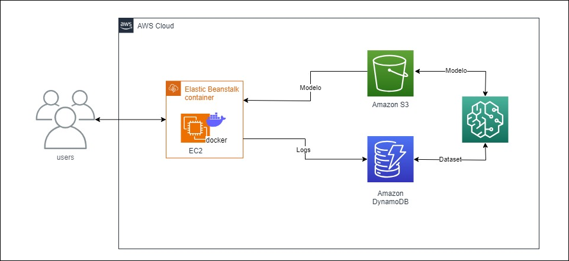

# HOTEL RESERVATION PREDICTION

> **OVERVIEW**

The project aims to develop a machine learning model capable of predicting the cost per room in a hotel reservation.

The creation and training of the model were carried out using Amazon SageMaker, and the training data is stored in DynamoDB. After training, the model is stored in Amazon S3. To enable the utilization of the model, an API service was developed using Python and the FastAPI framework to load the trained model from S3 and perform cost per room inference. The deployment of the service is conducted through AWS Elastic Beanstalk.

> **ARCHITECTURE**

> **MODEL TRAINING**

The dataset used is the [Hotel Reservations Dataset](https://www.kaggle.com/datasets/ahsan81/hotel-reservations-classification-dataset), which contains various information about thousands of reservations, including the price per room, our target variable for analysis. The dataset is stored in DynamoDB and retrieved within SageMaker.

> [!IMPORTANT]
> The data preprocessing included adding a new label column to classify the price into three numerical categories:
> [1] Price less than or equal to 85
> [2] Price is between 85 and 115
> [3] Price is greater than or equal to 115

Subsequently, the original column containing the price is removed. Additionally, exploratory data analysis was conducted to identify the most relevant correlations for training.

> [!NOTE]
> KNN, logistic regression, and XGBoost models were tested using both the original dataset and the dataset with selected relevant columns.

The results with the selected dataset were:

| Model                     | Precision | Recall | F1-score | Accuracy |
| ------------------------- | --------- | ------ | -------- | -------- |
| **KNN**                   | 0.62      | 0.62   | 0.62     | 0.62     |
| **Linear Learner**        | 0.57      | 0.59   | 0.56     | 0.57     |
| **XGBoost**               | 0.82      | 0.82   | 0.82     | 0.82     |
| **XGBoost Oversampling**  | 0.83      | 0.83   | 0.83     | 0.82     |
| **XGBoost Undersampling** | 0.83      | 0.83   | 0.83     | 0.83     |

The results with the original dataset were:

| Modelo                    | Precisão | Recall | F1-score | Acurácia |
| ------------------------- | -------- | ------ | -------- | -------- |
| **Linear Learner**        | 0.61     | 0.62   | 0.61     | 0.61     |
| **XGBoost**               | 0.84     | 0.84   | 0.84     | 0.837    |
| **XGBoost Oversampling**  | 0.85     | 0.85   | 0.85     | 0.84     |
| **XGBoost Undersampling** | 0.83     | 0.83   | 0.83     | 0.835    |

Based on the results, it was observed that the XGBoost model demonstrated the best performance with both datasets. Strategies such as oversampling, undersampling, and hyperparameter tuning were applied to enhance the model. It was concluded that the optimal performance of this model was achieved using the original dataset with oversampling, resulting in an accuracy of 84%.

> **API IMPLEMENTATION**

The Hotel Reservation Prediction API was developed using the FastAPI framework, leveraging its efficiency. Users can utilize Swagger to easily submit reservation details such as the number of adults, children, nights of stay, and lead time. The API returns the predicted class for the reservation, indicating the corresponding price range.

| Method | Endpoint        | Description                 |
| ------ | --------------- | --------------------------- |
| POST   | /api/v1/predict | Submits data for prediction |

The inference process comprises several sequential steps. Firstly, incoming parameters are received and subjected to validation using Pydantic, a Python library designed for data validation. Following this, categorical parameters undergo conversion into a binary numerical format to ensure compatibility with the model. Subsequently, the XGBoost model executes prediction operations on the transformed input data, facilitated by its ability to handle structured data effectively. Post-prediction, both the input parameters and the resultant prediction are recorded in the DynamoDB table, facilitating traceability and further analysis. Finally, the API response encapsulates the predicted class determined by the model, thus completing the inference process.

> **AUTHORS**

[Giovane Iwamoto](https://github.com/GiovaneIwamoto) | [Gustavo Serra](https://github.com/GustavoSVasconcelos) | [Isabela Buzzo](https://github.com/isabelabuzzo) | [Leandro Pereira](https://github.com/leojgpereira)
